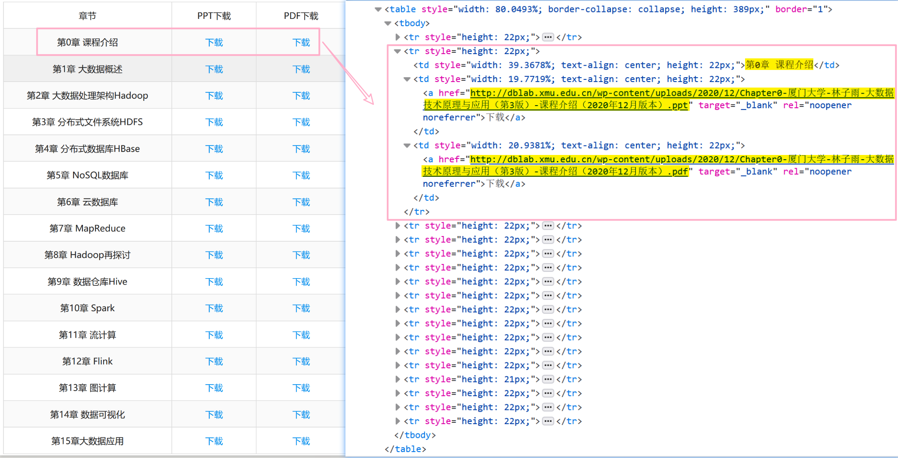
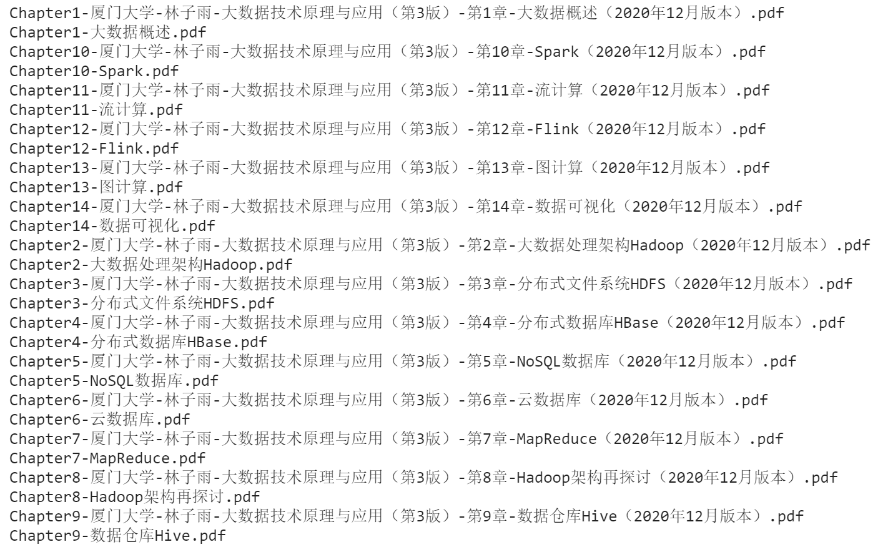

# 生活小技巧 | 一键下载+批量改名

最近在学习 Hadoop 的相关内容，厦门大学数据库实验室提供了相关内容的讲义，但是下载的时候要点击 17 次，文件默认的名称也较为繁琐，改名又需要操作 17 次。所以懒懒的奥利奥同学就开始研究有没有一些不太手动的方法，虽然这个过程花费的时间好像会更多（

如果你感兴趣的话，那就继续看下去吧。

应用场景：实现[页面]( [http://dblab.xmu.edu.cn/post/bigdata3ppt/](http://dblab.xmu.edu.cn/post/bigdata3ppt/) )所有 PPT 的一键下载，以及后续文件名的修改

代码获取：[github](https://github.com/Oreoxmt/Start-with-Me/tree/master/file-process)

# 一键下载

如果提供的是一个压缩包该多好，就不需要一个个点击了。

在一键下载时，可以通过以下两种方式实现。

（1）Python 大法

- 通过解析网页结构，获取下载链接，之后利用 requests + file.write 实现文件的保存
- 涉及内容：`requests` `lxml` `文件操作`
- 可自定义文件的名称

（2）文本编辑 + cmd 大法

- 利用文本编辑器的各种强大的编辑功能（本文以 VSCode 为例）将 F12 获取的页面内容快速处理为纯链接内容，之后利用 curl 实现文件的下载
- 下载文件的默认名称较为冗长，需要后续的进一步处理
- 涉及内容：`VSCode` `curl`

## Python requests + lxml + write

### 分析页面结构

通过查看源码发现与下载链接相关的核心部分是处于 `<tbody>` 中，表格的每一行对应一个 `<tr>` ，每一列对应一个 `<td>` 。

除了第一行为表头之外，其余每一行的第一列 `./td[1]/text()` 为“章节”（可以作为下载时的文件名），第二列 `./td[2]/a/@href` 为“PPT下载链接”，第三列 `./td[3]/a/@href` 为“PDF下载链接”，正如下图所示，每一行需要获取的内容即为荧光笔标出的部分。



- 通过 `requests` 请求访问，并获取除表头之外的内容

```python
url = "http://dblab.xmu.edu.cn/post/bigdata3ppt/"
ss = requests.Session()
r = ss.get(url)
r.encoding = "utf-8"
html = etree.HTML(r.text)
content = html.xpath('//tbody//tr')[1:]
```

### 保存下载链接

在获取所需要的页面内容之后，通过上述的分析，利用 `xpath` 将文件名、PPT链接、PDF链接保存至 allinfo list 中，便于之后进行下载。

```python
allinfo = []
for path in content:
    info = {
        "name":path.xpath('./td[1]/text()')[0],
        "ppt":path.xpath('./td[2]/a/@href')[0],
        "pdf":path.xpath('./td[3]/a/@href')[0]
    }
    allinfo.append(info)
```

### 进行下载

在保存了下载所需的链接之后，通过 `requests` 访问下载链接，通过文件读写实现下载。

这里的下载是把整个文件一次性下载到内存里，再保存的，可以考虑用 `requests` 的 `stream=True` 来实现按块下载，就是下载一点存一点，参考[这里]([https://requests.readthedocs.io/en/master/user/advanced/#body-content-workflow](https://requests.readthedocs.io/en/master/user/advanced/#body-content-workflow))。

```python
for info in allinfo:
    filename = info["name"]
    with open(f"{filename}.ppt", "wb") as f:
        resp = ss.get(info["ppt"])
        f.write(resp.content)
```

## F12 + VSCode + curl

### 编辑页面内容

前文分析页面结构发现，需要的下载链接位于 `<tbody>` 中，通过 edit as html 复制 `<tbody>...<tbody>` 的全部内容到 VSCode。

接着利用 VSCode 强大的 block edit 功能将 html 内容处理成纯链接的形式，涉及以下快捷键：

- `Ctrl+D`: 选中下一块相同的字串
- `Ctrl+Shift+方向键`: 以单词方式选中文字
- `Ctrl+Shift+Alt+方向键`: 按列选中文字

具体操作过程如下：


处理后的纯链接部分


在每个链接前添加 `curl -L -O` 以便于之后进行下载


### 进行下载

将上述处理后的内容复制到 cmd（可能会出现换行错误） / bash 运行 即可自动下载，注意 cd 到希望保存的路径

# 批量改名

通过第二种方法下载的文件，文件名较为冗余，可以通过 `curl -L -o 文件名` 解决。本文使用 Python `os` 进行处理，对于非下载场景下的批量改名同样适用。

```python
import os
os.chdir(r"./PPT")

for name in os.listdir():
    if name.endswith(".pdf"):
        print(name)
        newname = name.split('-')[0]+'-'+name.split('-')[5][:-16]+name.split('-')[5][-4:]
        print(newname)
        os.rename(name, newname)
```

修改前后名称对比，也可以使用正则表达式的方法



## 后记

通过前面的一系列折腾终于完成了一键下载+批量改名，在下载的文件数量较多时，还可以采用并行的方法，提高效率。

关于并行部分的内容或许会在下次更新....