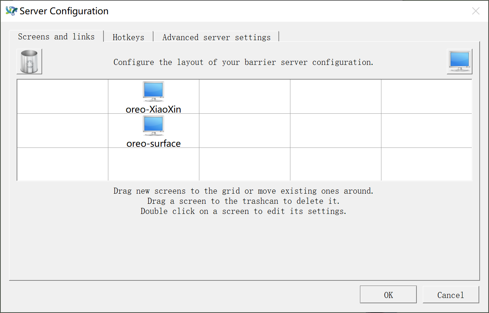
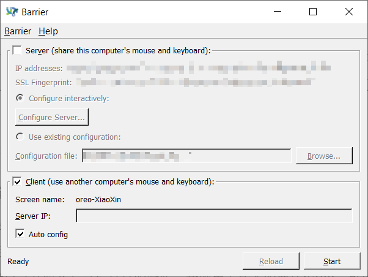
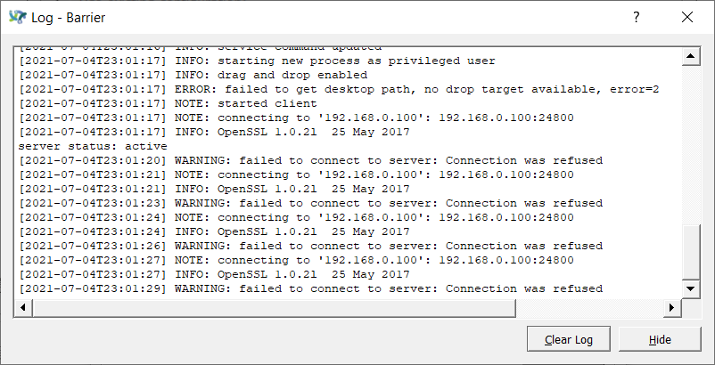

# 生活小技巧 | Barrier：低成本的键鼠共享

新一期的生活小技巧分享终于更新啦，这次是社畜奥奥的打工小技巧分享。

如果你需要同时使用多个终端，又不希望两个键盘、两个鼠标来回切换，或者说你只有一个键盘、一个鼠标却想要控制多个终端的话，那这个超级低成本的小技巧就非常适合你啦！

## 场景介绍

那先来介绍一下我自己的使用场景和设备情况吧。

设备1：便携高清低性能Windows+舒适的键盘+舒适的触摸板+舒适的鼠标

设备2：笨重大屏有显卡Linux（Ubuntu 20.04）+不喜欢的键盘+不喜欢的触摸板+没有鼠标

因为设备1主要是用来写写文档、追追剧、画画流程图，不能满足目前工作的需要（工位太空需要装饰），所以就把多年不用的设备2作为专属服务器和第二个显示屏了。因为以下的一系列的原因，我急需能够实现两个设备鼠键共享的工具。

1. 我只有一个蓝牙鼠标，而且这个鼠标还不支持一键切换设备
2. 设备1的键盘能够为我带来生产力，而设备2的键盘用不习惯
3. 为了让自己少低头（容易有双下巴），所以我想把设备2放到电脑支架上，然后放在设备1的后方，这样我就不方便使用设备1的键盘了
4. 需要这边复制那边粘贴
5. 没有资金去更换支持多设备连接的键鼠，也没有钱换一个生态的系列产品

所以为了更好地提高生产力，我选择了Barrier这个非常简单容易上手的工具，既能一拖切换设备，又能复制粘贴共享，还能省钱。

当你拥有并配置好了Barrier，只需要将鼠标从一个设备拖到边界，再拖一点就可以进入到另一个设备了，此时键盘也被共享啦。

如果觉得听起来很心动，那就一起行动起来吧。

## Barrier安装

[阅读README了解更多](https://github.com/debauchee/barrier)

### Windows安装

- 在[Barrier 的 Releases](https://github.com/debauchee/barrier/releases)页面选择合适的版本进行下载
- 奥奥选择的是[截至现在的最新版本 v2.3.3](https://github.com/debauchee/barrier/releases/download/v2.3.3/BarrierSetup-2.3.3-release.exe)
- 下载完成后就完成了安装，打开就完事了

### Linux安装

- 对Linux来说，各个发行版不同版本的安装方法会有所差异
- 如果你的Linux版本在上述README的[Distro specific packages](https://github.com/debauchee/barrier#distro-specific-packages)列表中，那么可以使用操作系统自带的包管理工具安装
    - 例如我的设备是Ubuntu 20.04，恰好在这个列表中，那么我采用的安装方式就是`apt install barrier`
- 如果你的Linux版本不在上述提到的列表中，那么可以参考Barrier的Github wiki编译安装，详细内容可以参见[Building on Linux](https://github.com/debauchee/barrier/wiki/Building-on-Linux)
- 安装成功之后就可以看见Barrier的图标啦，打开就完事了

## 多设备配置与使用

在下载安装成功之后，打开Barrier就可以看到非常简单易懂的配置页面。

### 确定你的Server与Client

Server: share this computer's mouse and keyboard

Client: use another computer's mouse and keyboard

就是把要共享键鼠的设备作为Server，被共享的就是Client

因为我希望使用设备1的键鼠去控制我的设备2，所以我的Server就是设备1，Client就是设备2，如果你想把键鼠共享给多个设备，那么设备3、设备4、设备n也是Client。

确定了谁是Server谁是Client之后就是分别进行配置啦

### 配置Server

- 首先来到设备1的Barrier界面，勾选Server以及Configure interactively
- 点击Configure Server...进行配置
- 在这里，可以点击窗口右上角的按钮拖一个小显示器到不同的位置，然后双击它填写 Screen name（Screen name 如何获取会在下一小节说明哦）
- 这里的网格代表屏幕之间的相对位置，例如下图，代表 oreo-XiaoXin 的屏幕在 oreo-surface 之上，当鼠标移动到 oreo-surface 的上边界时，它就能神奇地穿越到 oreo-XiaoXin 上啦
- 完成配置后记得关闭窗口点击Start，启动Barrier服务哦

### 配置Client

Client的配置就简单多了，通常直接选择Auto config就可以正常使用啦：

注意，在上面是可以看到Screen name的，这里的Screen name要和Server上配置的Screen name匹配，这样两者之间才能正常认证。

如果Auto config不管用，那么可以把Server界面上显示的IP address栏对应的IP地址填写到Server IP里（记得根据自己的网络情况选择一个呀），这样Client就可以找到Server了（嗯？有点奇怪）。

完成配置后，记得点击Start，启动Barrier客户端进行连接呀。

### 问题排查

有时候遇到问题，Barrier显示没有连接，那么可以尝试从日志里找一下信息。点击左上角菜单Barrier，并点击Show Log就可以看到日志：

例如上图的Client日志，代表无法连接到IP为192.168.0.100的服务器，此时就需要检查IP地址是否配置正确、防火墙是否拦截等问题啦。

## 一些其它解决方案

除了采用Barrier这种工具之外，还可以有很多其它的解决方案

1. 为什么要用两个设备，一个不行嘛！
2. 加钱换个键鼠（其实在写这篇分享的时候，我刚用上新买的罗技K380，可以支持三个设备的连接，但是需要按一下按键切换，对于记性不好和懒的我就很不好用）
3. 再加钱换个同一生态的设备，例如iPad、MacBook全家桶……

下一期奥奥可能会分享如何使用ZeroTier搭建内网，让处于不同网络的电脑可以互相访问，这样就可以随时随地打开电脑加班了！（社畜流泪）想催更的记得点赞哦~
