```mdx-code-block
import Tabs from '@theme/Tabs';
import TabItem from '@theme/TabItem';
```

## Introduction

:::info quote
Bytebase is an open-source database DevOps tool, it's the GitLab for managing databases throughout the application development lifecycle. It offers a web-based workspace for DBAs and Developers to collaborate and manage the database change safely and efficiently.
—[What is Bytebase](https://www.bytebase.com/docs/introduction/what-is-bytebase)
:::

Recently, I have been working on migrating a project's database from SQLite to TiDB Cloud. To facilitate the management of database changes, I decided to use a database DevOps tool and discovered [Bytebase](https://www.bytebase.com/). As a new user, I will share my first experience with Bytebase as I tackle the following tasks:

1. [Install Bytebase on macOS](#install-bytebase-on-macos)
2. [Quick start with Bytebase](#quick-start-with-bytebase)
3. [Query data](#query-data) and [modify schema](#modify-schema) using the sample data
4. [Integrate Bytebase with TiDB Cloud](#integrate-bytebase-with-tidb-cloud)

<!-- truncate -->

## Install Bytebase on macOS

My development environment is:

- macOS 13.2.1 (M1)
- Podman 4.3.1

I tried following the instructions in [Install Bytebase with Docker](https://www.bytebase.com/docs/get-started/install/deploy-with-docker), but an error occurred:

```shell-session
$ docker run --init \
  --name bytebase \
  --platform linux/amd64 \
  --restart always \
  --publish 5678:8080 \
  --health-cmd "curl --fail http://localhost:5678/healthz || exit 1" \
  --health-interval 5m \
  --health-timeout 60s \
  --volume ~/.bytebase/data:/var/opt/bytebase \
  bytebase/bytebase:1.12.1 \
  --data /var/opt/bytebase \
  --port 8080
# highlight-start
Error: statfs /Users/user/.bytebase/data: no such file or directory
# highlight-end
```

Due to a known bug [#351](https://github.com/containers/podman-compose/issues/351) with Podman's volume mounting, I modified the command by replacing `--volume ~/.bytebase/data:/var/opt/bytebase` with `--volume bytebase:/var/opt/bytebase`:

<Tabs>
  <TabItem value="command" label="Command">

  ```bash
  docker run --init \
  --name bytebase \
  --platform linux/amd64 \
  # highlight-start
  --restart unless-stopped \
  # highlight-end
  --publish 5678:8080 \
  --health-cmd "curl --fail http://localhost:5678/healthz || exit 1" \
  --health-interval 5m \
  --health-timeout 60s \
  # highlight-start
  --volume bytebase:/var/opt/bytebase \
  # highlight-end
  bytebase/bytebase:1.12.1 \
  --data /var/opt/bytebase \
  --port 8080
  ```

  </TabItem>
  <TabItem value="output" label="Output">

  ```
  ██████╗ ██╗   ██╗████████╗███████╗██████╗  █████╗ ███████╗███████╗
  ██╔══██╗╚██╗ ██╔╝╚══██╔══╝██╔════╝██╔══██╗██╔══██╗██╔════╝██╔════╝
  ██████╔╝ ╚████╔╝    ██║   █████╗  ██████╔╝███████║███████╗█████╗
  ██╔══██╗  ╚██╔╝     ██║   ██╔══╝  ██╔══██╗██╔══██║╚════██║██╔══╝
  ██████╔╝   ██║      ██║   ███████╗██████╔╝██║  ██║███████║███████╗
  ╚═════╝    ╚═╝      ╚═╝   ╚══════╝╚═════╝ ╚═╝  ╚═╝╚══════╝╚══════╝

  Version 1.12.1 (schema version 1.12.7) has started on port 8080

  ************* External Visiting URL (--external-url) *************

  !!! You have not set --external-url. If you want to make Bytebase
  !!! externally accessible, follow:

  https://www.bytebase.com/docs/get-started/install/external-url

  ******************************************************************
  ```

  </TabItem>
  <TabItem value="log" label="Log">

  ```bash
  # highlight-start
  INFO	server/server.go:208	-----Config BEGIN-----
  # highlight-end
  INFO	server/server.go:209	mode=prod
  INFO	server/server.go:210	dataDir=/var/opt/bytebase
  INFO	server/server.go:211	resourceDir=/var/opt/bytebase/resources
  INFO	server/server.go:212	externalURL=https://www.bytebase.com/docs/get-started/install/external-url
  INFO	server/server.go:213	readonly=false
  INFO	server/server.go:214	debug=false
  INFO	server/server.go:215	demoName=
  INFO	server/server.go:216	disallowSignup=false
  INFO	server/server.go:217	backupStorageBackend=LOCAL
  INFO	server/server.go:218	backupBucket=
  INFO	server/server.go:219	backupRegion=
  INFO	server/server.go:220	backupCredentialFile=
  INFO	server/server.go:221	-----Config END-------
  INFO	mysqlutil/mysqlutil.go:96	Installing MySQL utilities...
  INFO	mongoutil/mongoutil.go:52	Installing MongoDB utilities, it may take about several minutes...
  INFO	postgres/postgres.go:100	Installing PostgreSQL utilities...
  # highlight-start
  INFO	server/server.go:251	-----Sample Postgres Instance BEGIN-----
  # highlight-end
  INFO	server/server.go:253	sampleDatabasePort=8083
  INFO	server/server.go:254	sampleDataDir=/var/opt/bytebase/pgdata-sample
  # highlight-start
  INFO	postgres/postgres.go:223	-----Postgres initdb BEGIN-----
  # highlight-end
  initdb: warning: enabling "trust" authentication for local connections
  You can change this by editing pg_hba.conf or using the option -A, or
  --auth-local and --auth-host, the next time you run initdb.
  INFO	postgres/postgres.go:227	-----Postgres initdb END-----
  INFO	server/server.go:258	-----Sample Postgres Instance END-----
  # highlight-start
  INFO	server/server.go:263	-----Embedded Postgres Config BEGIN-----
  # highlight-end
  INFO	server/server.go:264	datastorePort=8082
  INFO	server/server.go:265	pgDataDir=/var/opt/bytebase/pgdata
  INFO	server/server.go:266	-----Embedded Postgres Config END-----
  # highlight-start
  INFO	postgres/postgres.go:223	-----Postgres initdb BEGIN-----
  # highlight-end
  initdb: warning: enabling "trust" authentication for local connections
  You can change this by editing pg_hba.conf or using the option -A, or
  --auth-local and --auth-host, the next time you run initdb.
  INFO	postgres/postgres.go:227	-----Postgres initdb END-----
  INFO	pg/migrate.go:60	Bytebase migration schema not found, creating schema...	{"environment": "", "instance": ""}
  INFO	pg/migrate.go:108	Successfully created migration schema.	{"environment": "", "instance": ""}
  INFO	store/pg_engine.go:302	Apply database migration if needed...
  INFO	store/pg_engine.go:304	The database schema has not been setup.
  INFO	store/pg_engine.go:318	The prod cutoff schema version: 1.12.7
  INFO	store/pg_engine.go:378	Completed database initial migration with version 1.12.7.
  INFO	store/pg_engine.go:157	Current schema version after migration: 1.12.7
  ```

  </TabItem>
</Tabs>

Bytebase has been successfully installed and is now up and running.

To access Bytebase, navigate to `http://localhost:5678` and set up an admin account.


Then, click **Sign up**, and the Bytebase dashboard is displayed.


## Quick start with Bytebase

To quickly get started with Bytebase, you can follow the **Quickstart** guide.

### View an issue

On the **Issues** page, you can approve an issue, leave a comment, or cancel it.


### Visit projects

On the **Projects** page, you can view all existing projects or create a new one.


To get detailed information about the **Sample Project**, you can click **SAM** and go to its overview page.


### Visit environments

On the **Environments** page, you can manage the existing environment (`Test` and `Prod` by default) or create a new one.

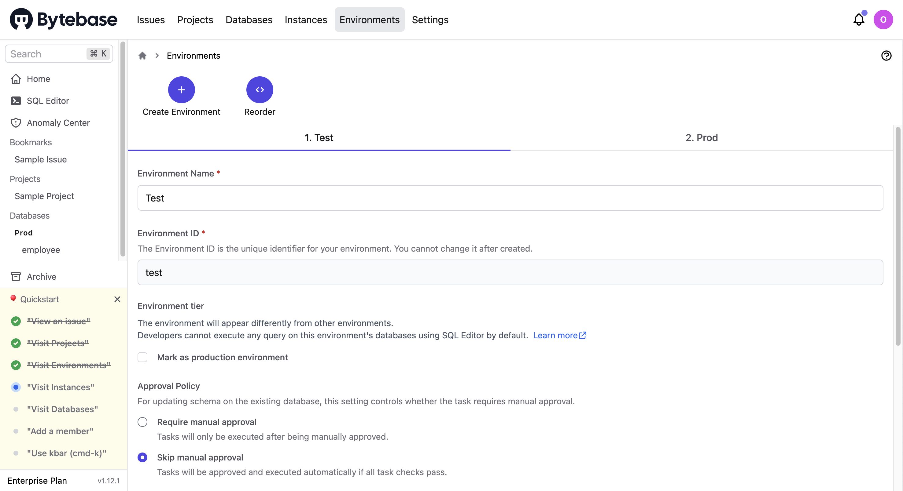

### Visit instances

On the **Instances** page, you can manage the existing instances or add a new one.

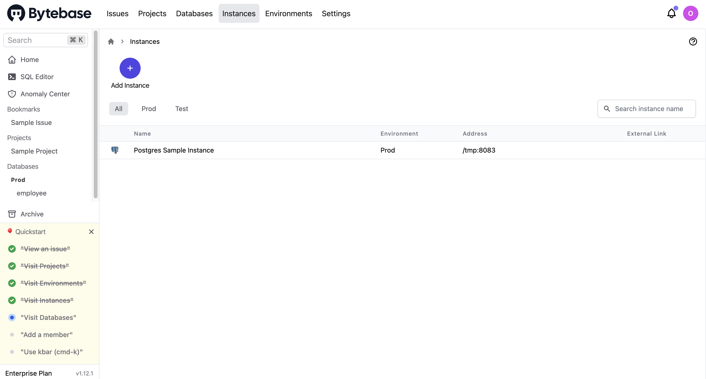

For each instance, you can configure an admin user and a read-only user.

### Visit databases

On the **Databases** page, you can manage the existing databases (**Alter Schema**, or **Change Data**) or add a new database (**New DB**).

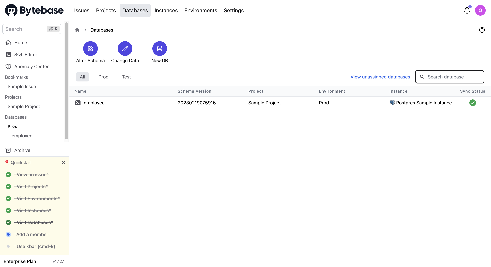

For each database, you can use the **Schema Diagram** to view the schema or use the **SQL Editor** to query data.

The following is the schema diagram of the **employee** database.

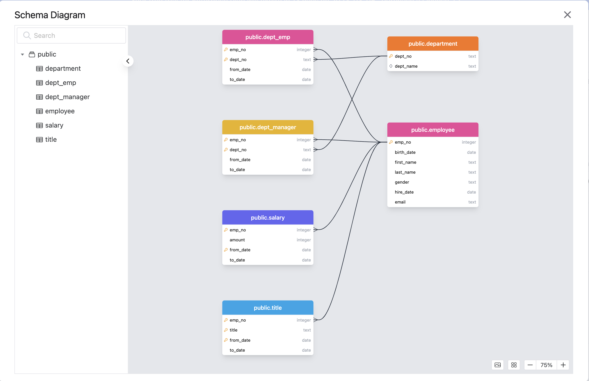

#### Query data

You can use the **SQL Editor** to query data. The following example lists employees who have been employed for more than 30 years and sorts the results by their hire date and gender.

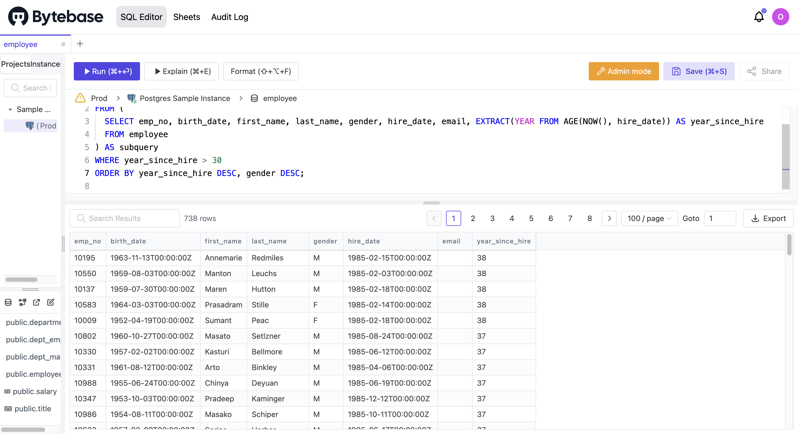

#### Modify schema

To add a new column `github_name` to the `employee` table, you can click **Alter Schema**, select the **employee** table, and then click **Add column**.

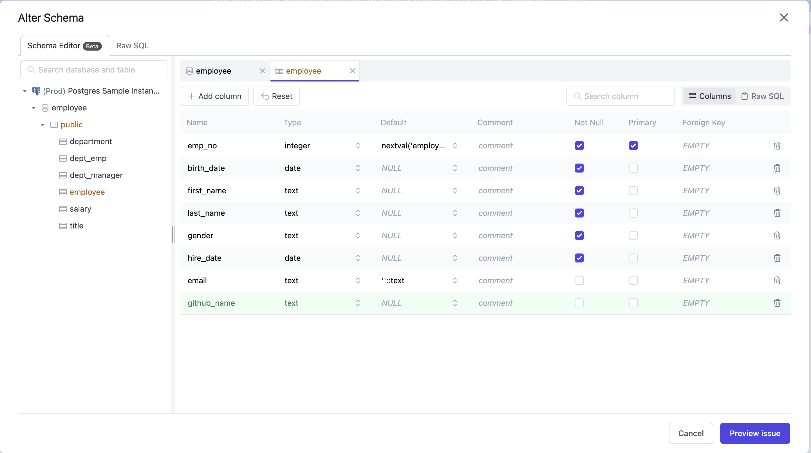

After entering the column name (`github_name`) and type (`text`), click **Preview issue** and the **New issue** page is displayed with the SQL generated automatically.

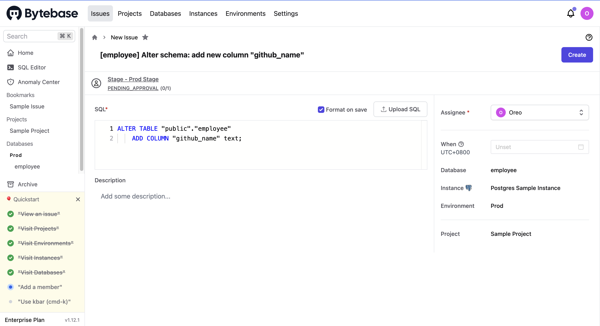

After confirming the schema change, you can click **Create** and then **Approve** this change.

Then, you can view the change details on the **Databases > employee > Change** page.

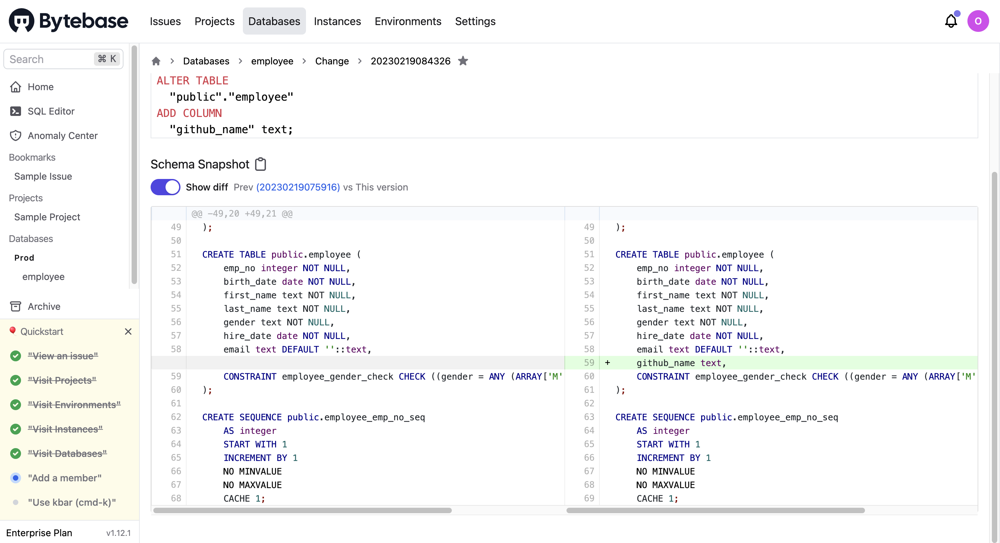

### Add a member

On the **Settings > Members** page, you can add a new member to the project and manage existing members.

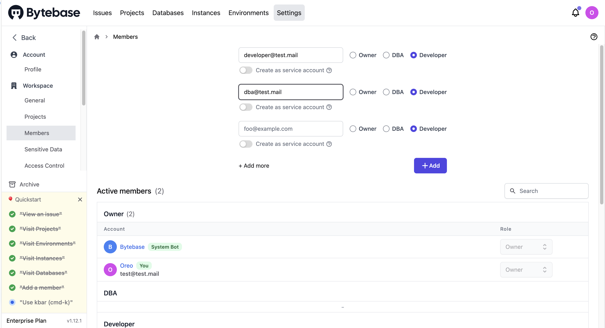

### Use kbar (cmd-k)

To quickly navigate to the page you want, press <kbd>Command+K</kbd>.

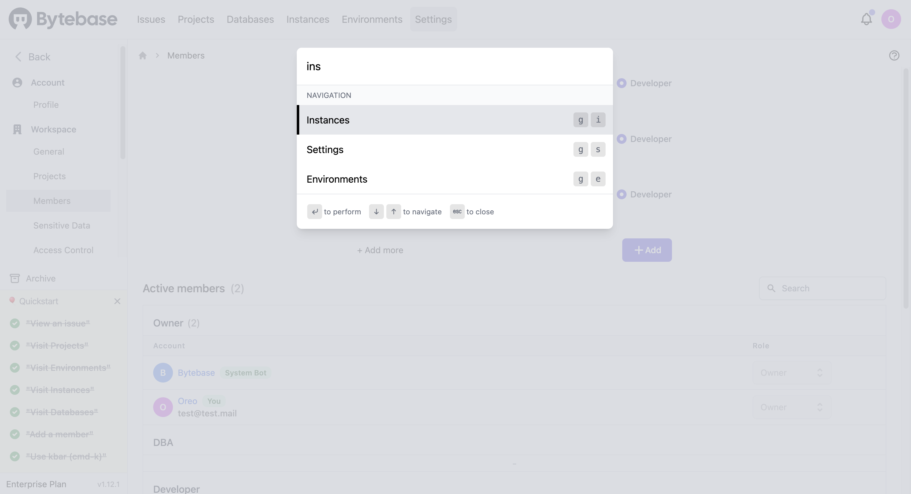

## Integrate Bytebase with TiDB Cloud

This section describes how to integrate Bytebase with TiDB Cloud.

1. Create a TiDB Cloud cluster. For more details, refer to [TiDB Cloud Quick Start](https://docs.pingcap.com/tidbcloud/tidb-cloud-quickstart).

  The following uses a Serverless Tier cluster as an example.

2. To create an instance in Bytebase, perform the following steps:

    1. Click **Instances** on the top bar and then click **New Instance**. The **Create Instance** page is displayed.

    2. Select **TiDB** as the **Instance Type**, enter an **Instance Name**, select the **Environment**, and enter the **Host** and **Port** of your TiDB Cloud cluster.

      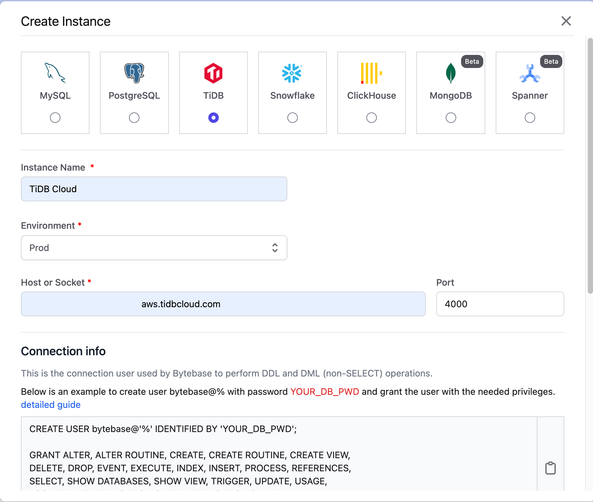

    3. Create a new user (`prefix.bytebase`) in TiDB Cloud and fill in the **Username** and **Password** of the user:

      ```sql
      CREATE USER 'prefix.bytebase'@'%' IDENTIFIED BY 'YOUR_DB_PWD';

      GRANT ALTER, ALTER ROUTINE, CREATE, CREATE ROUTINE, CREATE VIEW,
      DELETE, DROP, EVENT, EXECUTE, INDEX, INSERT, PROCESS, REFERENCES,
      SELECT, SHOW DATABASES, SHOW VIEW, TRIGGER, UPDATE, USAGE,
      LOCK TABLES, REPLICATION CLIENT, REPLICATION SLAVE
      ON *.* to 'prefix.bytebase'@'%';
      ```
    4. Configure the SSL connection of TiDB Cloud. For Serverless Tier clusters, use the **CA Certificate**.

      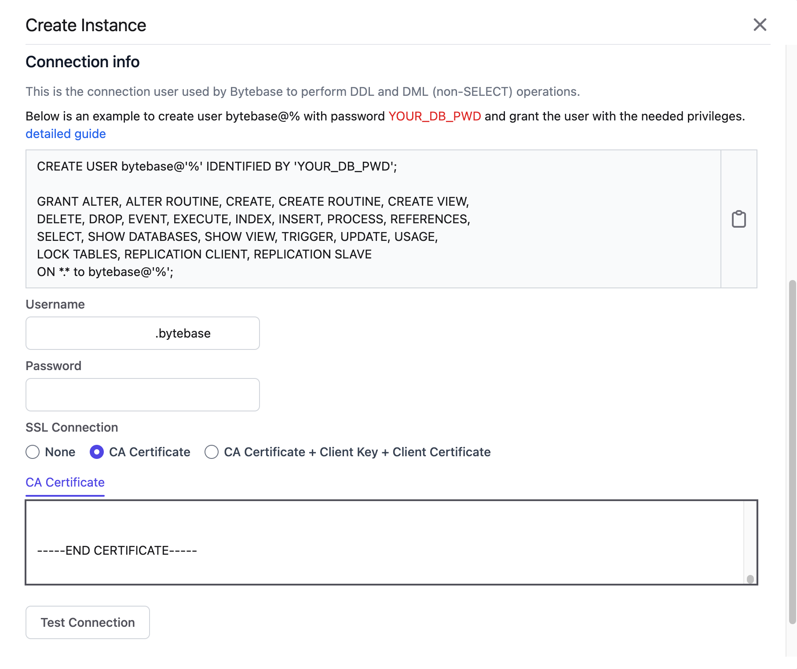

    5. Click **Test Connection** and check the connection status.

    6. Once the message `Successfully connected instance` is displayed, click **Create**.

3. Create a new project for TiDB Cloud by performing the following steps:

    1. Click **Projects** on the top bar and then click **New Project**. The **Create Project** page is displayed.

    2. Enter the **Project Name** (`TiDB`) and **Project Key** (`TIDB`), and then click **Create**.

    3. Click the newly created project, and then click **Transfer in DB**. The **Transfer in database** page is displayed.

    4. Select the `gharchive_dev` database and click **Transfer**.

      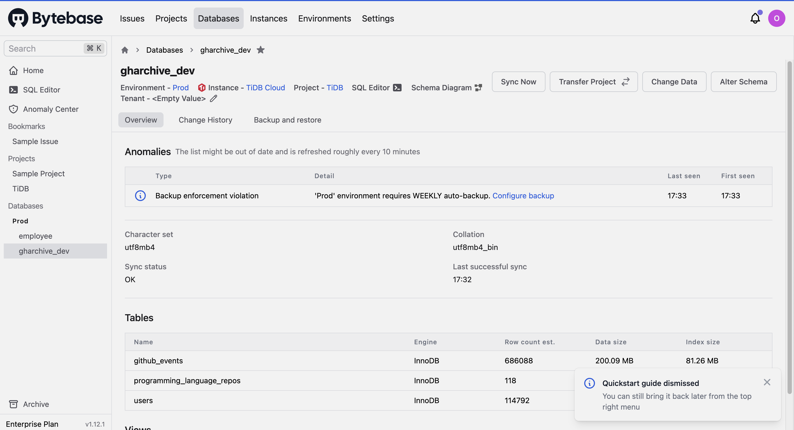

## Personal thoughts

- Does the **Quickstart** guide help you get started with Bytebase?

  The guide is easy to follow and helps me quickly understand the main concepts and pages of Bytebase. However, I think it would be better if the guide provides step-by-step instructions on how to complete a task, such as creating a new instance, and includes information on what details to pay attention to, such as the details of a project.

- Do you have a good understanding of the core features of Bytebase after completing these two tasks?

  Yes. By completing the two tasks, I am able to use the SQL advisor, schema editor, schema diagram, migration history, and SQL editor features. But I have not yet tried the VCS integration, backup and restore, and other features.

- Do you encounter any difficulties when deploying Bytebase?

  Yes. As Bytebase is only available in x86 architecture, binary translation is required to run it on the M1 chip. However, when I tried to run Bytebase in an Ubuntu 22.04 ARM virtual machine (set up by UTM with Apple Virtualization backend), the container crashed due to a segmentation fault. Strangely, Bytebase runs without any problem in Podman's virtual machine. The crash no longer occurred after I switched the x86 binary interpreter from Rosetta to QEMU. Something is likely incompatible with Rosetta.

- Does the SQL editor meet your needs?

  Yes. The SQL editor meets my needs. It supports syntax highlighting, auto-completion, and anonymize data. It also provides a schema diagram, which helps to understand the database schema.
