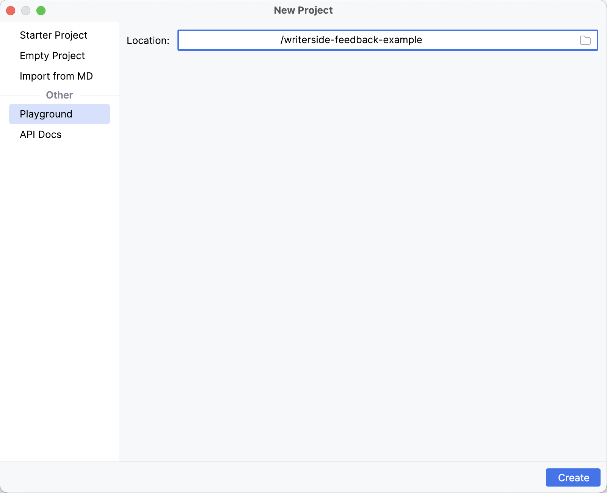
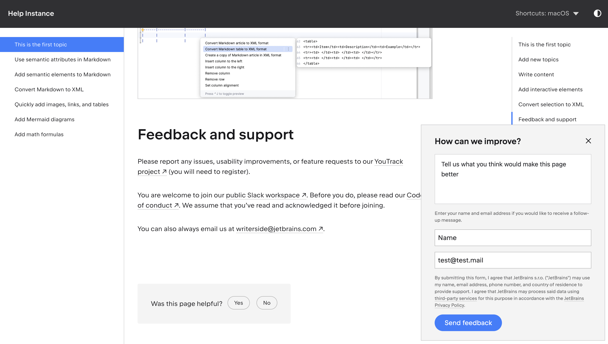
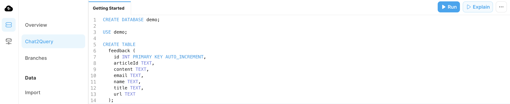
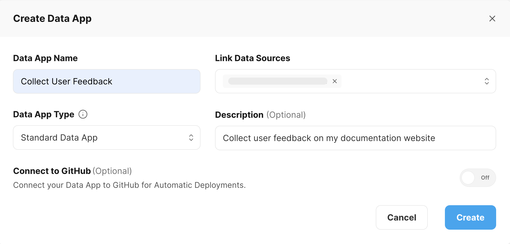
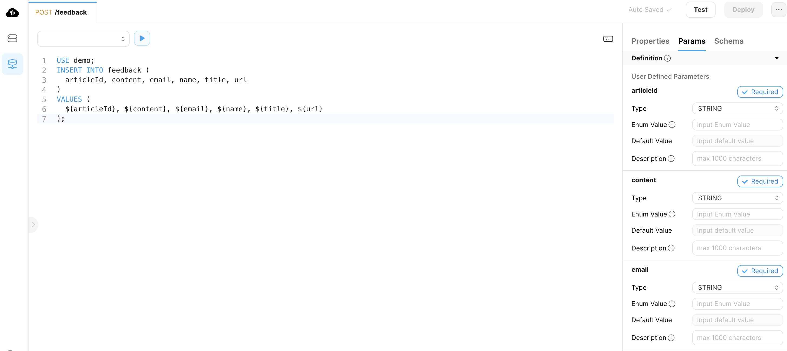
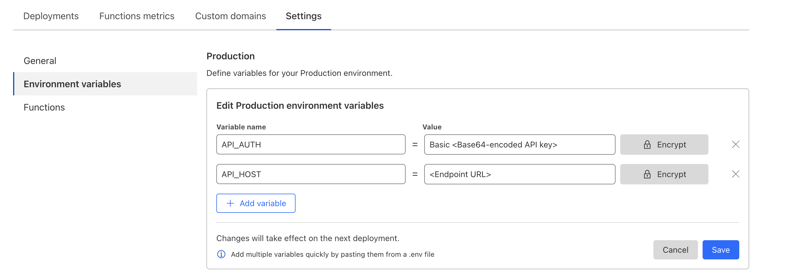
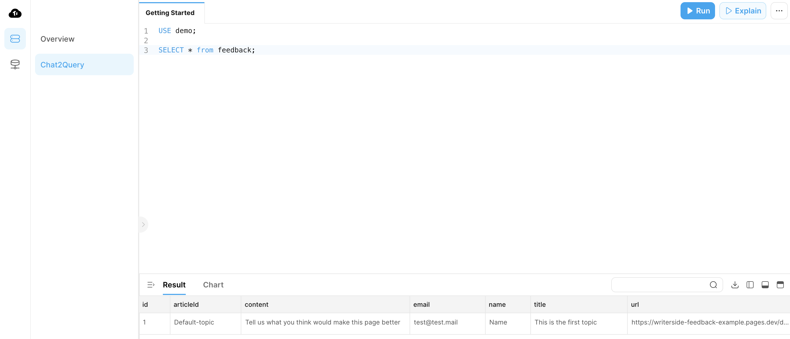

```mdx-code-block
import Tabs from '@theme/Tabs';
import TabItem from '@theme/TabItem';
```

I am currently using [Writerside](https://www.jetbrains.com/writerside/), a new Integrated Development Environment (IDE) designed for technical writers, to create and develop the documentation website for my side project, [PingCAP Docsite Preview](https://pdp.oreo.life/intro). Throughout my experience with Writerside, I discovered an undocumented feature: a feedback module. I have utilized Cloudflare Pages Functions and TiDB Cloud Data Service to process the feedback received through this module and store it in the database.

This guide provides step-by-step instructions for integrating a feedback module into your website. It utilizes Writerside, [Cloudflare Pages Functions](https://developers.cloudflare.com/pages/functions/), and [TiDB Cloud Data Service](https://docs.pingcap.com/tidbcloud/data-service-overview) for this integration. This will enable you to collect valuable user feedback directly through your website.

View the demo code: [`writerside-feedback-example`](https://github.com/Oreoxmt/writerside-feedback-example)

Try the feedback widget: [Feedback example page](https://writerside-feedback-example.pages.dev/add-math-formulas.html)

<!-- truncate -->

## Prerequisites

- A Writerside project. If you do not have one yet, see [Create Writerside project and deploy it to Cloudflare Pages](#1-set-up-a-writerside-project-and-deploy-to-cloudflare-pages).
- A [TiDB Cloud](https://tidb.cloud) cluster.
- A [Cloudflare](https://www.cloudflare.com) account.

## 1. Set up a Writerside project and deploy to Cloudflare Pages

Code example: [commit/10a7107](https://github.com/Oreoxmt/writerside-feedback-example/commit/10a7107f45eaa8d79c5cdcbe23c4b9147bbbc483)

1. Create a new project in [Writerside](https://www.jetbrains.com/writerside/) from the **Playground** option:

    

    For easy deployment, I upload this project to GitHub and then use GitHub Actions to build and deploy the website to Cloudflare Pages.

2. Configure GitHub Action workflow:

  The newly created project includes two instances: **hi** and **si**. The following workflow only deploys the **hi** instance to Cloudflare Pages.

  ```yaml title=".github/workflows/deploy.yml"
  name: Build documentation

  on:
    push:
      branches: ["main"]
    workflow_dispatch:

  env:
    INSTANCE: writerside-feedback/hi
    ARTIFACT: webHelpHI2-all.zip
    DOCKER_VERSION: 233.14272

  jobs:
    build:
      runs-on: ubuntu-latest
      steps:
        - name: Checkout repository
          uses: actions/checkout@v4

        - name: Build Writerside docs using Docker
          uses: JetBrains/writerside-github-action@v4
          with:
            instance: ${{ env.INSTANCE }}
            artifact: ${{ env.ARTIFACT }}
            docker-version: ${{ env.DOCKER_VERSION }}

        - name: Upload documentation
          uses: actions/upload-artifact@v4
          with:
            name: docs
            path: |
              artifacts/${{ env.ARTIFACT }}
              artifacts/report.json
            retention-days: 7

    deploy:
      needs: build
      runs-on: ubuntu-latest
      permissions:
        contents: read
        deployments: write
      name: Deploy to Cloudflare Pages
      steps:
        - name: Download artifact
          uses: actions/download-artifact@v4
          with:
            name: docs
        - name: Unzip artifact
          run: |
            unzip -O UTF-8 ${{ env.ARTIFACT }} -d public
        - name: Install Node.js
          uses: actions/setup-node@v4
          with:
            node-version: '18'
        - name: Publish
          run: |
            cd public
            npx wrangler@3 pages deploy . --project-name writerside-feedback-example
          env:
            CLOUDFLARE_API_TOKEN: ${{ secrets.CLOUDFLARE_API_TOKEN }}
            CLOUDFLARE_ACCOUNT_ID: ${{ secrets.CLOUDFLARE_ACCOUNT_ID }}
  ```

  This workflow first builds the Writerside project using [`JetBrains/writerside-github-action`](https://github.com/JetBrains/writerside-github-action). It then deploys the documentation website to Cloudflare Pages using [`wrangler`](https://github.com/cloudflare/workers-sdk).

  Note that you need to configure `CLOUDFLARE_API_TOKEN` and `CLOUDFLARE_ACCOUNT_ID` in your GitHub repository secrets. For more information, refer to [Create secrets for a repository](https://docs.github.com/en/actions/security-guides/using-secrets-in-github-actions#creating-secrets-for-a-repository), [Create an API token](https://developers.cloudflare.com/fundamentals/api/get-started/create-token), and [Find zone and account IDs](https://developers.cloudflare.com/fundamentals/setup/find-account-and-zone-ids).

3. Trigger deployment:

  After configuring `CLOUDFLARE_API_TOKEN` and `CLOUDFLARE_ACCOUNT_ID`, you can trigger the `deploy.yml` workflow. The [website](https://writerside-feedback-example.pages.dev/) will become accessible within a few minutes. You can find the URL of your website on the Cloudflare Pages project page.

## 2. Enable the feedback widget in Writerside

Code example: https://github.com/Oreoxmt/writerside-feedback-example/commit/25d63e0dda916b655a8c1cf869b3ed6d9d6e82d9

### Configuration

To enable the feedback widget, modify the `cfg/buildprofiles.xml` file as follows:

```xml title="cfg/buildprofiles.xml"
<?xml version="1.0" encoding="UTF-8"?>
<buildprofiles xsi:noNamespaceSchemaLocation="https://resources.jetbrains.com/writerside/1.0/build-profiles.xsd"
               xmlns:xsi="http://www.w3.org/2001/XMLSchema-instance">
// highlight-start
    <variables>
        <feedback-widget>true</feedback-widget>
        <feedback-url>https://www.test.com</feedback-url>
    </variables>
// highlight-end
</buildprofiles>
```

Then, you can trigger the `deploy.yml` workflow once more. After the deployment is completed, the feedback widget appears at the bottom of each page in your website.

### Feedback widget behavior

Given that this feature is not officially documented, you can monitor the feedback widget's behavior in your browser's developer mode. For example, you can submit a feedback as follows:



After clicking **Send feedback**, you will notice that a request is sent to the feedback URL `https://www.test.com` with the feedback information in the request payload.

```json
{
  "articleId": "Default-topic",
  "content":"Tell us what you think would make this page better",
  "name":"Name",
  "email":"test@test.mail",
  "title":"This is the first topic",
  "url":"https://writerside-feedback-example.pages.dev/default-topic.html#feedback-and-support"
}
```

Additionally, you might notice a prompt `Feedback wasn't sent. Please try again later.`. This occurs because the feedback URL `https://www.test.com` is not available.

In conclusion, the feedback module sends a `POST` request to the specified feedback URL, containing the feedback information in the request payload as follows:

```json
{
  "articleId":"starter-topic",
  "content":"Feedback content",
  "name":"(Optional) Feedback user name",
  "email":"(Optional) Feedback user email",
  "title":"Page title",
  "url":"Page URL"
}
```

Therefore, it is necessary to have a server in place to receive this request and store the feedback information in a database. TiDB Cloud Data Service is an excellent option for this purpose.

## 3. Configure TiDB Cloud Data Service for feedback storage

1. [Create a TiDB Serverless cluster](https://docs.pingcap.com/tidbcloud/create-tidb-cluster-serverless) and initialize the database as follows. For convenience, you can use [Chat2Query](https://docs.pingcap.com/tidbcloud/explore-data-with-chat2query) in the TiDB Cloud console.

  ```sql
  CREATE DATABASE demo;

  USE demo;

  CREATE TABLE
    feedback (
      id INT PRIMARY KEY AUTO_INCREMENT,
      articleId TEXT,
      content TEXT,
      email TEXT,
      name TEXT,
      title TEXT,
      url TEXT
    );
  ```

  

2. Navigate to the [**Data Service**](https://tidbcloud.com/console/data-service) page and [create a new Data App](https://docs.pingcap.com/tidbcloud/data-service-manage-data-app#create-a-data-app).

  

3. Create an endpoint in the newly created Data App:

  - Set the **Path**, for example, `/feedback`.
  - Select **POST** as the **Request Method**.
  - Input the following SQL statements into the editor:

    ```sql
    USE demo;
    INSERT INTO feedback (
    articleId, content, email, name, title, url
    )
    VALUES (
    ${articleId}, ${content}, ${email}, ${name}, ${title}, ${url}
    );
    ```

  - Configure the parameters as follows:

    | Parameter | Type   | Description              |
    |-----------|--------|--------------------------|
    | articleId | String | The article ID.          |
    | content   | String | The feedback content.    |
    | email     | String | The feedback user email. |
    | name      | String | The feedback user name.  |
    | title     | String | The page title.          |
    | url       | String | The page URL.            |

  

4. Click **Deploy** in the upper-right corner to deploy the endpoint.

5. Copy the **Endpoint URL** from the **Properties** tab. Then, update this URL in the `cfg/buildprofiles.xml` file:

  ```xml title="cfg/buildprofiles.xml"
  <?xml version="1.0" encoding="UTF-8"?>
  <buildprofiles xsi:noNamespaceSchemaLocation="https://resources.jetbrains.com/writerside/1.0/build-profiles.xsd"
                 xmlns:xsi="http://www.w3.org/2001/XMLSchema-instance">
    <variables>
        <feedback-widget>true</feedback-widget>
        // highlight-start
        <feedback-url>https://{YOUR_DOMAIN}/feedback</feedback-url>
        // highlight-end
    </variables>
  </buildprofiles>
  ```

6. Trigger the `deploy.yml` workflow again. After the deployment is completed, you can submit a feedback and observe its response using the developer mode of your browser.

  You will notice that the feedback submission results in a `401` response. This happens because the endpoint lacks authentication. To make your API keys secure, consider using Cloudflare Pages Functions to send the request, as it enables you to keep the token secret.

## 4. Configure Cloudflare Pages Functions to forward the feedback request

Code example: https://github.com/Oreoxmt/writerside-feedback-example/commit/dd61bd4157c34f50308ef085e8d5b424dc79bb82

1. Create the `functions/feedback.js` file to forward the feedback request:

  ```js title = "functions/feedback.js"
  export async function onRequest(context) {
    const resp = await fetch(context.env.API_HOST, {
      method: 'POST',
      headers: {
        'Content-Type': 'application/json',
        'Authorization': context.env.API_AUTH
      },
      body: context.request.body
    });
    return new Response("Hi there!");
  }
  ```

  This function forwards the feedback request to TiDB Cloud Data Service, which is configured in the `API_HOST` and `API_AUTH` environment variables.

2. Incorporate the *Add function folder to output file* step in the `deploy.yml` workflow. After building the documentation, this step adds the `functions` folder to the output file, facilitating the deployment of the function to Cloudflare Pages.

  ```yaml title=".github/workflows/deploy.yml"
  name: Build documentation

  jobs:
    build:
      runs-on: ubuntu-latest
      steps:
        - name: Checkout repository
          ...
        - name: Build Writerside docs using Docker
          ...
        # highlight-start
        - name: Add function folder to output file
          run: sudo zip -r "artifacts/${{ env.ARTIFACT }}" functions/
        # highlight-end
        - name: Upload documentation
          ...
    deploy:
      ...
  ```

3. Navigate to your TiDB Cloud Data App and [create an API key](https://docs.pingcap.com/tidbcloud/data-service-api-key#create-an-api-key) with **ReadAndWrite** role.

4. Convert the public key and private key into a base64 encoded string. For example, if your public key is `public_key` and your private key is `private_key`, you can encode them as follows:

    ```shell
    echo -n "public_key:private_key" | base64
    # cHVibGljX2tleTpwcml2YXRlX2tleQ==
    ```

5. In your Cloudflare Pages project (`writerside-feedback-example` in this example), configure the following environment variables:

    - `API_HOST`: The endpoint URL.
    - `API_AUTH`: The base64 encoded API key. For example, `Basic cHVibGljX2tleTpwcml2YXRlX2tleQ==`.

    

6. Trigger the `deploy.yml` workflow once more. After the deployment is completed, you can submit a feedback and verify that it is successfully stored in the database.

  

## Conclusion

When you submit a feedback on [this page](https://writerside-feedback-example.pages.dev/add-math-formulas.html), the following process occurs:

1. The feedback widget sends a `POST` request to the feedback URL (Cloudflare Pages Functions) with the feedback information in the request payload.
2. The function receives the request and forwards it to the endpoint URL (TiDB Cloud Data Service) with the API token.
3. TiDB Cloud Data Service receives the request and stores the feedback information in the database.
