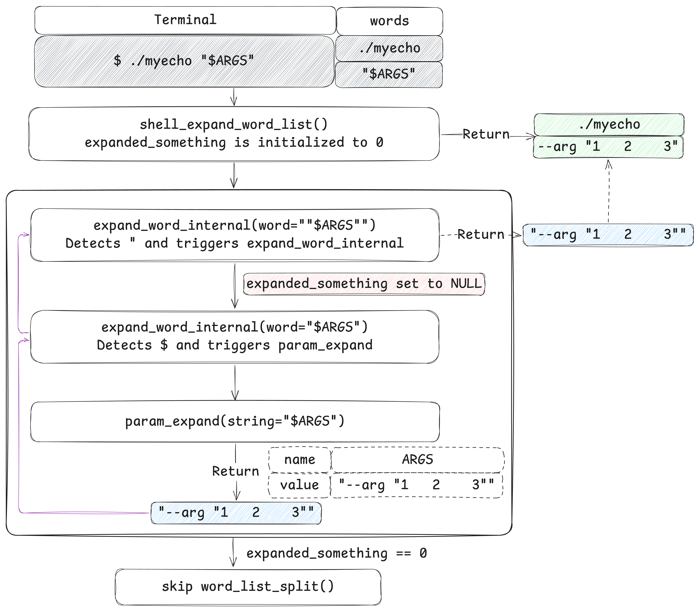
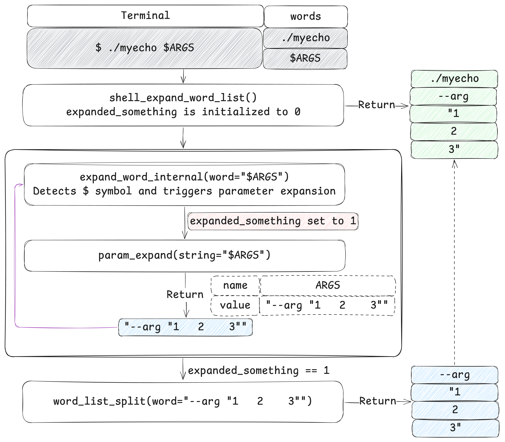

```mdx-code-block
import Tabs from '@theme/Tabs';
import TabItem from '@theme/TabItem';
```

While we often hear the advice "always quote your variables in Bash", there are specific scenarios where using quotes can lead to unexpected behavior. This post explores when quotes around variables can be problematic and explains the underlying Bash expansion process by diving into its source code.

<!-- truncate -->

## Background: An issue caused by quotes

While migrating a continuous delivery (CD) process to Tencent Cloud, I initially used [`coscli`](https://www.tencentcloud.com/document/product/436/43249), Tencent's official CLI tool. However, I encountered a frustrating issue: if the `coscli cp` command fails, it doesn't return a non-zero exit code, causing GitHub Actions workflows to hang until the six-hour timeout. To support other S3-compatible cloud storage providers and avoid vendor lock-in, I switched to [`rclone`](https://rclone.org). In my previous post, [Always Use Braces Around Variables in Bash/Zsh](../2025-02-19-always-use-braces-around-variables-bash-zsh.md), I shared lessons from implementing the CD process with `rclone`. This post dives into a Bash command processing issue I encountered while using `coscli`.

Troubleshooting this Bash expansion issue gave me deeper insight into what happens after you enter commands in a terminal. In this post, I will explain how double quotes around variables, such as `"$ARGS"`, can sometimes cause unexpected issues and what actually happens during Bash's expansion process.

My journey began with a script that successfully connected to a Tencent Cloud storage bucket on my local machine. However, when I migrated this to a GitHub Actions workflow and stored the arguments in a variable (`COSCLI_ARGS`) for easier maintenance, it unexpectedly failed.

<Tabs>
  <TabItem label="Local Bash script" value="local-script">

  ```bash title="test.sh"
  #!/bin/sh

  set -x

  # Download and set up coscli
  curl -fsSL https://cosbrowser.cloud.tencent.com/software/coscli/coscli-linux-amd64 >coscli && chmod +x ./coscli

  # Define environment variables
  TENCENTCLOUD_SECRET_ID="***"
  TENCENTCLOUD_SECRET_KEY="***"
  TENCENTCLOUD_BUCKET_ID="***"

  # List contents of the bucket
  ./coscli ls \
    --endpoint "cos.ap-beijing.myqcloud.com" \
    --secret-id "${TENCENTCLOUD_SECRET_ID}" \
    --secret-key "${TENCENTCLOUD_SECRET_KEY}" \
    --init-skip=true \
    "cos://${TENCENTCLOUD_BUCKET_ID}/test"
  ```

  </TabItem>
  <TabItem label="GitHub Actions workflow" value="gh-workflow">

  ```yaml title="test.yaml"
  name: Debug COS Bucket Access

  on:
    workflow_dispatch:

  jobs:
    run:
      name: Debug COS Bucket Access
      runs-on: ubuntu-22.04
      env:
        COSCLI_ARGS: >
          --endpoint "cos.ap-beijing.myqcloud.com"
          --secret-id "${{ secrets.TENCENTCLOUD_SECRET_ID }}"
          --secret-key "${{ secrets.TENCENTCLOUD_SECRET_KEY }}"
          --init-skip=true
        TENCENTCLOUD_BUCKET_ID: ${{ secrets.TENCENTCLOUD_BUCKET_ID }}
      steps:
        - uses: actions/checkout@v4
        - name: Install coscli
          run: curl -fsSL https://cosbrowser.cloud.tencent.com/software/coscli/coscli-linux-amd64 >coscli && chmod +x ./coscli
        - name: List bucket contents
          run: ./coscli ls $COSCLI_ARGS "cos://$TENCENTCLOUD_BUCKET_ID/test/"
  ```

  </TabItem>
  <TabItem label="Error output" value="gh-log">

  ```shell
  Run ./coscli ls $COSCLI_ARGS "cos://$TENCENTCLOUD_BUCKET_ID/test/"
    ./coscli ls $COSCLI_ARGS "cos://$TENCENTCLOUD_BUCKET_ID/test/"
    shell: /usr/bin/bash -e {0}
    env:
      COSCLI_ARGS: --endpoint "cos.ap-beijing.myqcloud.com" --secret-id "***" --secret-key "***" --init-skip=true
      TENCENTCLOUD_BUCKET_ID: ***
  # highlight-next-line
  ERRO invalid bucket format, please check your cos.BaseURL
  ```

  </TabItem>
</Tabs>

To debug, I added `set -x` to see the exact command being executed:

```shell
+ ./coscli ls --endpoint '"cos.ap-beijing.myqcloud.com"' --secret-id '"***"' --secret-key '"***"' --init-skip=true cos://***/test/
ERRO invalid bucket format, please check your cos.BaseURL
```

When I compared this with how the command runs successfully on my local machine, I noticed a critical difference:

```diff
+ ./coscli ls --endpoint '"cos.ap-beijing.myqcloud.com"' --secret-id '"***"' --secret-key '"***"' --init-skip=true cos://***/test/
- ./coscli ls --endpoint cos.ap-beijing.myqcloud.com --secret-id '***' --secret-key '***' --init-skip=true 'cos://***/test'
```

The issue was that the `--endpoint` value in the GitHub Actions workflow had extra quotes (`'"cos.ap-beijing.myqcloud.com"'`), which made it invalid for `coscli`.

The solution was straightforward: I removed the quotes around the arguments in the `COSCLI_ARGS` variable.

<Tabs>
  <TabItem label="Before" value="gh-yaml-before">

  ```yaml title="test.yaml"
  env:
    COSCLI_ARGS: >
      --endpoint "cos.ap-beijing.myqcloud.com"
      --secret-id "${{ secrets.TENCENTCLOUD_SECRET_ID }}"
      --secret-key "${{ secrets.TENCENTCLOUD_SECRET_KEY }}"
      --init-skip=true
  ```

  </TabItem>
  <TabItem label="After" value="gh-yaml-after">

  ```yaml title="test.yaml"
  env:
    COSCLI_ARGS: >
      --endpoint cos.ap-beijing.myqcloud.com
      --secret-id ${{ secrets.TENCENTCLOUD_SECRET_ID }}
      --secret-key ${{ secrets.TENCENTCLOUD_SECRET_KEY }}
      --init-skip=true
  ```
  </TabItem>
</Tabs>

## Experimentation: The actual arguments received

Although removing the quotes resolved the issue, I wanted to dig deeper to understand the root cause. Specifically, I aimed to clarify when to quote variables and when not to. To investigate, I wrote a script, `myecho`, to display the actual arguments received by a command:

```bash title="myecho"
#!/usr/bin/env python3

import sys

print("\n".join(f"argv[{idx}]=|{arg}|"for idx, arg in enumerate(sys.argv)))
```

This script prints each argument passed to it, along with its position in the argument list. I then created several test cases to explore how Bash handles variable expansion and quoting.

<Tabs>
  <TabItem label="Unquoted variable" value="case-no-quotes">

  ```shell
  ARGS='--arg "1  2   3"'
  ./myecho $ARGS

  # argv[0]=|./myecho|
  # argv[1]=|--arg|
  # argv[2]=|"1|
  # argv[3]=|2|
  # argv[4]=|3"|
  ```

  </TabItem>
  <TabItem label="Quoted variable" value="case-quotes">

  ```shell
  ARGS='--arg "1  2   3"'
  ./myecho "$ARGS"

  # argv[0]=|./myecho|
  # argv[1]=|--arg "1  2   3"|
  ```

  </TabItem>
</Tabs>

I expected the command to receive two arguments: `--arg` and `"1  2   3"`. When I ran `./myecho "$ARGS"`, the entire string `--arg "1  2   3"` was passed as a single argument. However, running `./myecho $ARGS` produced the following output:

```log
argv[0]=|./myecho|
argv[1]=|--arg|
argv[2]=|"1|
argv[3]=|2|
argv[4]=|3"|
```

This was surprising: Bash split the argument string at each space, even those within the quoted substring, treating them as delimiters rather than preserving the substring's integrity.

## Investigation: The order of Bash expansion

:::info quote

- Expansion is performed on the command line after it has been split into words.
- The order of expansions is: brace expansion; tilde expansion, parameter and variable expansion, arithmetic expansion, and command substitution (done in a left-to-right fashion); word splitting; and pathname expansion.
- After these expansions are performed, quote characters present in the original word are removed unless they have been quoted themselves (quote removal).

—[Bash Reference Manual: Shell Expansions](https://www.gnu.org/software/bash/manual/html_node/Shell-Expansions.html)
:::

This section focuses on **parameter expansion** and **word splitting**, as they are directly relevant to the test cases.

Greg's wiki on [Arguments](https://mywiki.wooledge.org/Arguments) helped me understand these concepts. I will follow the Bash processing order outlined in this document (quoting/escaping -> parameter expansion -> word splitting) to explain them.

1. **Quoting/escaping**: marks characters as literal rather than syntactical, protecting them from being interpreted as special characters. For example:

    ```bash
    # Print the content of a file with spaces in its name:
    cat "This is a file.md"
    ```

2. **Parameter expansion**: extracts data from a variable and inserts it into the command. For example, the variable `$FILENAME` is replaced by its value, `test.md`:

    ```shell
    FILENAME="test.md"
    cat $FILENAME
    # After parameter expansion: cat test.md
    ```

    :::tip

    The value of `FILENAME` is `test.md`, not `"test.md"`, because the variable's value undergoes expansion and quote removal before being stored.

    :::

3. **Word splitting**: after expansion, Bash splits words based on the IFS (Internal Field Separator). By default, IFS includes spaces, tabs, and newlines.

    ```shell
    ./myecho "This is a file.md"
    # argv[0]=|./myecho|
    # argv[1]=|This is a file.md|

    ./myecho This is a file.md
    # argv[0]=|./myecho|
    # argv[1]=|This|
    # argv[2]=|is|
    # argv[3]=|a|
    # argv[4]=|file.md|
    ```

Let's apply these concepts to the test cases.

<Tabs>
  <TabItem label="Unquoted variable" value="explain-unquoted">

  For the unquoted variable case:

  ```shell
  ARGS='--arg "1  2   3"'
  ./myecho $ARGS

  # argv[0]=|./myecho|
  # argv[1]=|--arg|
  # argv[2]=|"1|
  # argv[3]=|2|
  # argv[4]=|3"|
  ```

  - Quoting: not applicable.
  - Parameter expansion: `$ARGS` expands to `--arg "1  2   3"`.
  - Word splitting: the spaces in `--arg "1  2   3"` are treated as syntactical, not literals. As a result, the string is split into `--arg`, `"1`, `2`, and `3"`.

  </TabItem>
  <TabItem label="Quoted variable" value="explain-quoted">

  For the quoted variable case:

  ```shell
  ARGS='--arg "1  2   3"'
  ./myecho "$ARGS"

  # argv[0]=|./myecho|
  # argv[1]=|--arg "1  2   3"|
  ```

  - Quoting: `"$ARGS"` ensures that all characters in `$ARGS` are treated as literals.
  - Parameter expansion: `"$ARGS"` expands to `"--arg "1  2   3""`.
  - Word splitting: not applicable because the spaces in `"--arg "1  2   3""` are treated as literals.

  </TabItem>
</Tabs>

From Greg's wiki, I also learned that for my use case, a better approach is to store arguments in an array instead of a string. :)

<Tabs>
  <TabItem label="Before (using a string)" value="myecho-args-before">

  ```shell
  ARGS='--arg "1  2   3"'
  ./myecho $ARGS

  # argv[0]=|./myecho|
  # argv[1]=|--arg|
  # argv[2]=|"1|
  # argv[3]=|2|
  # argv[4]=|3"|
  ```

  </TabItem>
  <TabItem label="After (using an array)" value="myecho-args-after">

  ```shell
  ARGS=(--arg "1  2   3")
  ./myecho "${ARGS[@]}"

  # argv[0]=|./myecho|
  # argv[1]=|--arg|
  # argv[2]=|1  2   3|
  ```

  </TabItem>
</Tabs>

## Revelation: Digging into the rabbit hole

Curious about how these two cases differ during runtime execution, I decided to dive deeper by cloning Bash's source code and debugging both scenarios step by step. The execution path is intricate, so I will focus on the key steps and skip some of the finer details in the following explanation.

### Case 1: Unquoted variable

```shell
ARGS='--arg "1  2   3"'
./myecho $ARGS

# argv[0]=|./myecho|
# argv[1]=|--arg|
# argv[2]=|"1|
# argv[3]=|2|
# argv[4]=|3"|
```

The following is a step-by-step breakdown of what happens:

1. **Lexical analysis**

    Bash identifies `./myecho` and `$ARGS` as two separate words after lexical analysis. The simplified data structure of `current_command` looks like this:

    ```yaml
    current_command: {
      type: "cm_simple",
      value: {
        Simple: {
          words: {
            word: "./myecho",
            next: "$ARGS"
          }
        }
        # Other command types, such as For, Case, and While, are omitted.
      }
    }
    ```

2. **Command execution**

    Bash calls `execute_simple_command()` with `current_command.value.Simple` as input. Inside this function, `expand_word_list_internal()` handles the expansion of each word. The first word, `./myecho`, is processed directly. Now, let's focus on how `$ARGS` is expanded.

    

3. **Word expansion**

    `expand_word_list_internal()` calls `shell_expand_word_list()`, initializing `expanded_something` to `0`. Then, `expand_word_internal()` is called recursively:

    1. `expand_word_internal()` processes `word="$ARGS"` character by character. The first character `$` triggers parameter expansion. Then, `expanded_something` is set to `1`, and `param_expand()` is called.
    2. `param_expand()` processes `string="$ARGS"` with `expanded_something=1`, identifies the variable `ARGS`, and returns its value: `--arg "1  2   3"`.
    3. `expand_word_internal(word="$ARGS")` returns `--arg "1  2   3"`, with `expanded_something` now set to `1`.

4. **Word splitting**

    Since `expanded_something` is `1`, `word_list_split()` splits `word="--arg "1  2   3""` into `--arg`, `"1`, `2`, and `3"`.

5. **Result of word expansion**

    `shell_expand_word_list()` returns the following word expansion result for `$ARGS`:

    ```yaml
    new_list: {
      word: "--arg",
      next: {
        word: ""1",
        next: {
          word: "2",
          next: {
            word: "3"",
            next: NULL
          }
        }
      }
    }
    ```

6. **Result of command execution**

    `expand_word_list_internal()` returns the complete word list for `./myecho` and `$ARGS`, which Bash uses to construct an [`execve()`](https://man7.org/linux/man-pages/man2/execve.2.html) system call:

    ```yaml
    words: {
      word: "./myecho",
      next: {
        word: "--arg",
        next: {
          word: ""1",
          next: {
            word: "2",
            next: {
              word: "3"",
              next: NULL
            }
          }
        }
      }
    }
    ```

### Case 2: Quoted variable

```shell
ARGS='--arg "1  2   3"'
./myecho "$ARGS"

# argv[0]=|./myecho|
# argv[1]=|--arg "1  2   3"|
```

The following is a step-by-step breakdown of what happens:

1. **Lexical analysis**

    Bash identifies `./myecho` and `"$ARGS"` as two separate words after lexical analysis. The simplified data structure of `current_command` looks like this:

    ```yaml
    current_command: {
      type: "cm_simple",
      value: {
        Simple: {
          words: {
            word: "./myecho",
            next: ""$ARGS""
          }
        }
        # Other command types, such as For, Case, and While, are omitted.
      }
    }
    ```

2. **Command execution**

    Bash calls `execute_simple_command()` with `current_command.value.Simple` as input. Inside this function, `expand_word_list_internal()` handles the expansion of each word. The first word, `./myecho`, is processed directly. Now, let's focus on how `"$ARGS"` is expanded:

    

3. **Word expansion**

    `expand_word_list_internal()` calls `shell_expand_word_list()`, initializing `expanded_something` to `0`. Then, `expand_word_internal()` is called recursively:

    1. `expand_word_internal()` processes `word=""$ARGS""` character by character. The first character is `"`, so Bash calls `string_extract_double_quoted()` to extract the content, which returns `$ARGS`.
    2. `expand_word_internal()` processes `word="$ARGS"` with `expanded_something=NULL`. This indicates that the initial value of `expanded_something` remains unchanged during this recursion. The first character `$` triggers parameter expansion.
    3. `param_expand()` processes `string="$ARGS"` with `expanded_something=NULL`, identifies the variable `ARGS`, and returns its value: `--arg "1  2   3"`.
    4. `expand_word_internal(word="$ARGS")` returns `--arg "1  2   3"`.
    5. The outer `expand_word_internal(word=""$ARGS"")` returns `--arg "1  2   3"`, and `expanded_something` remains `0`.

4. **Word splitting**

    Since `expanded_something` is `0`, `word_list_split()` is **not** performed on `word="--arg "1  2   3""`.

5. **Result of word expansion**

    `shell_expand_word_list()` returns the following word expansion result for `"$ARGS"`:

    ```yaml
    new_list: {
      word: "--arg "1  2   3"",
      next: NULL
    }
    ```

6. **Result of command execution**

    `expand_word_list_internal()` returns the complete word list for `./myecho` and `"$ARGS"`, which Bash uses to construct an [`execve()`](https://man7.org/linux/man-pages/man2/execve.2.html) system call:

    ```yaml
    words: {
      word: "./myecho",
      next: {
        word: "--arg "1  2   3"",
        next: NULL
      }
    }
    ```

## My Bash journey: From copy-pasting to puzzle pieces

Fifty days ago, I fell down the rabbit hole of Bash expansion. What started as a simple quote-related issue led me to repeatedly read Bash documentation and Greg's wiki, and eventually the source code itself. Diving into Bash's source code became one of the boldest moves I made this year. Before this deep dive, my understanding of Bash expansion came from scattered documentation and observed behaviors. It wasn't until I studied the actual implementation that I truly grasped how it works, particularly regarding parameter expansion and word splitting.

Actually, two years ago, when writing Bash scripts, I'd mechanically wrap variables in curly braces and quotes, or use `IFS=` in `while` loops without understanding why. I followed these "best practices" simply because [ShellCheck](https://www.shellcheck.net) told me or Stack Overflow answers suggested them. But after spending a few nights figuring out Bash's expansion, I finally get *why* those practices exist.

This mirrors my journey with Git and Docker. Early on, I relied on memorization and copy-pasting. But that changed with deeper learning about their internal mechanisms. On the surface, the way I use Git and Docker now might look the same as two years ago. But now, I know *what* I'm doing, *why* it works, and how to troubleshoot issues. I can handle custom needs, critically review LLM-generated commands, and adapt to unexpected situations.

An interesting story is that after reading [Docker build cache](https://github.com/docker/docs/blob/3d5b40fc20d46fe0919cffee4377c5b39fa84e38/content/build/cache/_index.md), I decided to optimize a Dockerfile I wrote years ago. To my surprise, I had already implemented multi-stage builds—even though I didn't know what multi-stage builds were at the time. (I linked to the GitHub version of the document because the [official one](https://docs.docker.com/build/cache/) was later restructured, and I prefer this version's organization and step-by-step optimization guidance.)

Some might ask, "Why bother researching things you can use directly without understanding them? You'll forget the details anyway." They're right - specific implementation details will fade. But the experience of investigation, the process of uncovering how things work, that feeling will remain. More importantly, I have a new understanding of what happens when I type a command in the terminal. If asked in an interview, I've gone from knowing nothing, to knowing the step of identifying whether a command is built-in or an executable file, then to knowing about TTY, and now to understanding how commands are parsed, expanded, and sent to system calls. And every sentence in my answer might imply an interesting debug story.

Like solving a puzzle, I've gradually pieced together fragments of Bash's inner workings. While completing the full picture remains challenging, I still celebrate every time my own exploration helps snap a few pieces into place. 👍
